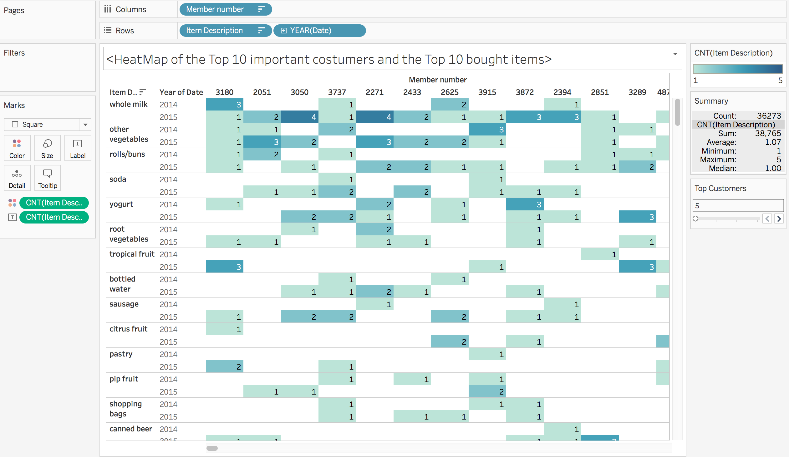
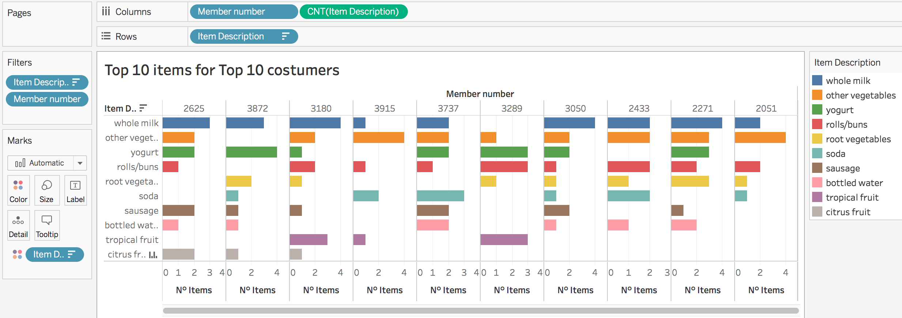
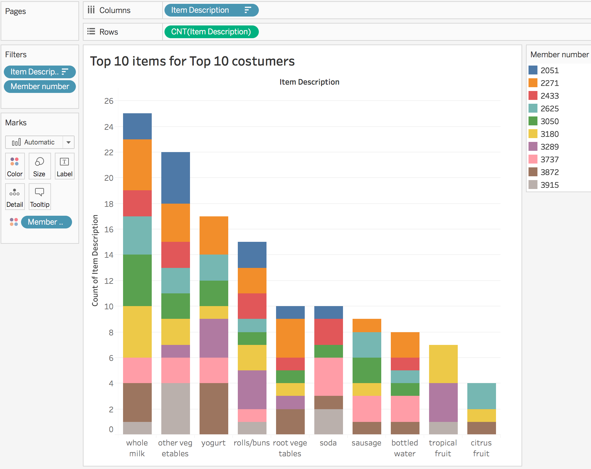
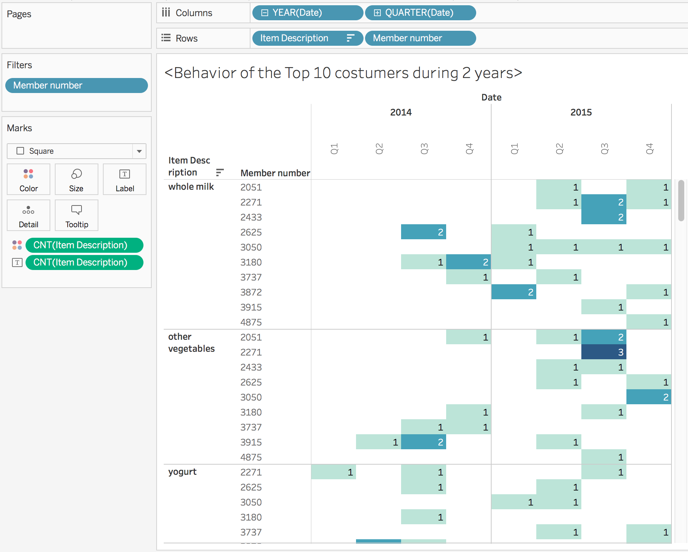
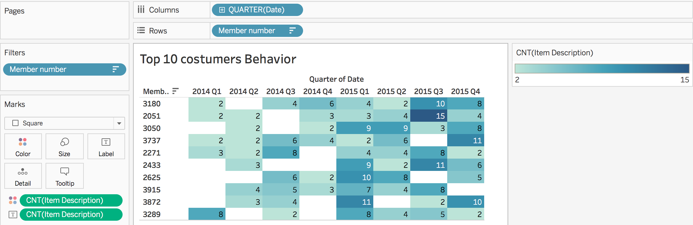
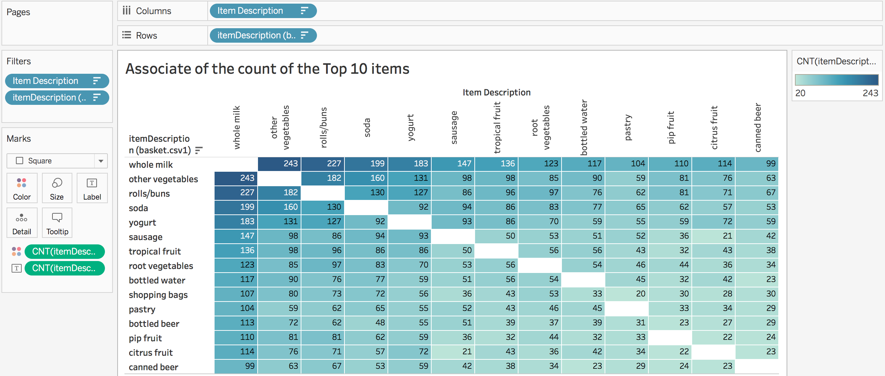
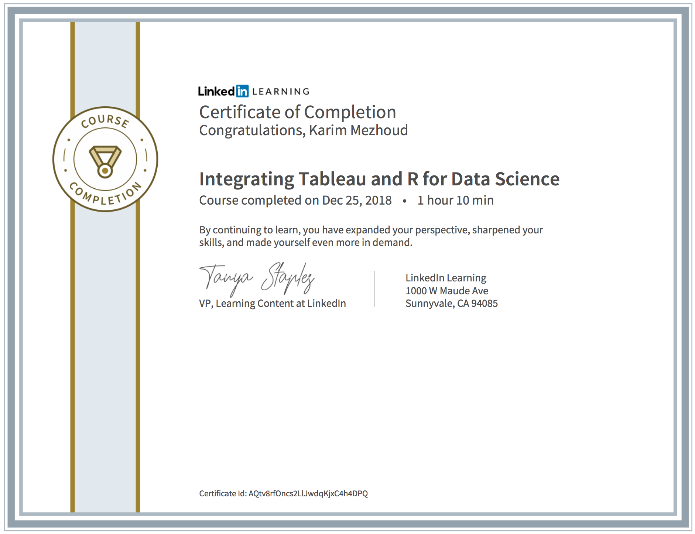
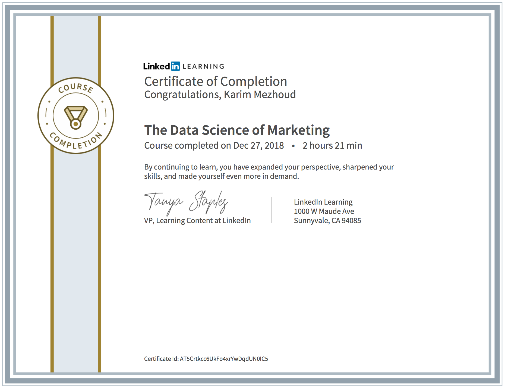

##  Top 10 sold Items for the Top 10 Costumers
There are different graphes that can illustrate le most important purchased items and the most important costumers.

### Highlight table of the Top 10 items vs Top 10 costumers

With this highlight table we can view the frequency of the purchases of each item, for each costumer, and during certain period.



### Individual Bar plot for each costumer
This graph is useful if we want to compare simultaneously each items consumption for the most important costumers.



### Stacked Bar plot
This bar plot is intersting and make easy to identify the difference between costumers uptakes.



## Highlight table of the behavior of the top 10 costumers by items 

This highlight table shows us that 2015 has more active business than 2014, at less for whole milk. 



## Highlight table of the behavior of the top 10 costumers for all items



### Video -  How to generate highlight tables of Top 10s and Behavior 

<iframe width="760" height="515" src="https://www.youtube.com/embed/4rygQswqD5g" frameborder="0" allow="accelerometer; autoplay; encrypted-media; gyroscope; picture-in-picture" allowfullscreen></iframe>


## Highlight table: Correlation between Top 10 sold items
We use ```arules``` algorithme to plot the top 10 purchased items. Surprisingly, the top 10 items are also the most correlated. 




### Video -  How to generate the highlight table of the correlation between the top 10 items

<iframe width="760" height="515" src="https://www.youtube.com/embed/0vTD0dLt1vY" frameborder="0" allow="accelerometer; autoplay; encrypted-media; gyroscope; picture-in-picture" allowfullscreen></iframe>


# Integrate ```R``` into TABLEAU: A simple running example

I tried to run a simple scripts writen with R into TABLEAU. TABLEAU has four types of data that can handle with R: `Booleen`, `String`, `Real`, `Integer`. I tried to return from R a dataframe that collapse the transactions, and obtain all items (basket) for each transaction in one row. This function return to TABLEAU a new dataframe with 3 columns: factor (memberID), Date, and string (items list) data type. 
The question is: How can TABLEAU handle dataframe or tibble with R? It is very useful and important to handle multiple type of data in the same run or task!

## Assays to run ```R``` script into TABLEAU

<iframe width="760" height="515" src="https://www.youtube.com/embed/-18luszIos8" frameborder="0" allow="accelerometer; autoplay; encrypted-media; gyroscope; picture-in-picture" allowfullscreen></iframe>


# Certificates

### Training to integrate R in TABLEAU



